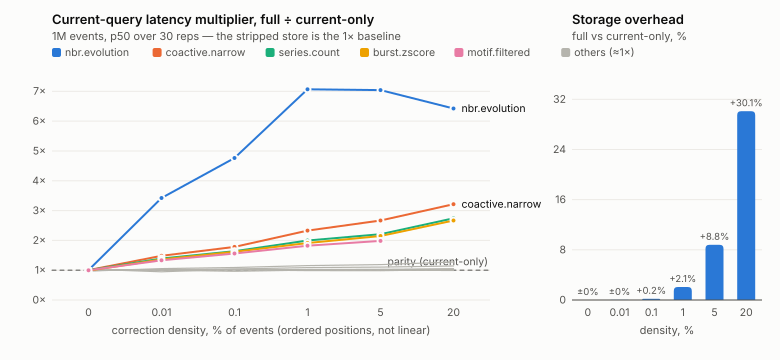

# Current-state versus bi-temporal overhead (plan §13)

What do two clocks cost when no historical question is being asked? This
answers the evaluation plan's §13 with a controlled pair: the unmodified
engine versus a stripped **current-only configuration** of the same store,
across correction density.

## Receipts (spec §8.4)

- commit `1e81393` (clean), branch `eval-bitemporal`; raw records
  `benchmarks/results-v1/eval-1m-bitemporal.json` (density sweep) and
  `benchmarks/results-v1/eval-10m-bitemporal.json` (10M at 0.1%)
- both raw records' own `agree` flags read `false`: the run's original
  gate counted guardrail refusals as mismatches — one-sided for
  `motif.filtered` at 1M/20% (below), two-sided for `paths.k` and
  `reach.window` at 10M (both variants refused; the pre-reprice 10M
  guardrail cells, exactly as the capability matrix records). Post-hoc
  verification over the records shows **zero hash mismatches among
  queries both variants answered, at every density and both scales**;
  the gate was corrected to the harness's `partial` semantics in the
  commit after the 1M run, and the records are kept verbatim
  (supersessions are part of the record).
- host: xzgpu — 40 cores, 93 GB, Linux 5.4.0-216-generic x86_64; same host
  as every published table
- protocol: plan §16.3 — 5 warmups, 30 measured reps per sub-second query
  (10 for slower), median reported here, p95 and raw timings in the JSON
- one reference event log per (scale, density), replayed once (D-023); the
  current-only store starts as a **byte-identical copy** of the replayed
  store, so the two variants differ only in what the strip removed
- every current-belief query is hash-verified between the variants before
  anything is compared — `agree: true` at every density; the run exits
  nonzero on any mismatch
- both variants measured at steady state: full = `compact()` + `gc(0)`,
  current-only = `compact_current_only()` + `gc(0)` — retention headroom
  would otherwise dominate the storage delta
- correction mix: the harness baseline's proportions (whole-interval :
  carve : retract = 200 : 10 : 50, plus one node correction), uniformly
  placed, applied in 2000-op batches through the write-ahead log. Age
  profiles are §12.3's axis, not §13's.

## The two configurations

**native-full** — the engine as shipped. Corrections close `tt_e` via
close runs and segment sidecars; every scan carries the belief predicate.

**native-current** — the §13 stripped configuration
(`compact_current_only()`): superseded versions, close runs, and sidecars
are physically dropped; the store is stamped `CURRENT_ONLY` and from then
on **refuses** past-belief queries and corrections rather than answering
them wrongly (`hist.asof` is recorded as refused at every density —
that refusal is part of the contract, not a failure).

Eleven of the twelve registry queries run under current belief; those are
the comparison set. `hist.asof` runs on the full store only.

## Storage (1M events, steady state, bytes)

| density | corrections | full | current-only | bi-temporal overhead |
|---|---|---|---|---|
| 0% | 0 | 24,450,049 | 24,450,465 | ±0.0% |
| 0.01% | 103 | 24,601,262 | 24,597,301 | +0.02% |
| 0.1% | 1,003 | 25,215,120 | 25,168,725 | +0.2% |
| 1% | 10,009 | 26,196,517 | 25,663,277 | +2.1% |
| 5% | 51,541 | 30,368,226 | 27,912,432 | +8.8% |
| 20% | 215,002 | 46,519,312 | 35,756,055 | +30.1% |

Both stores grow with density — a correction writes a superseding version
whose props are real data, and a carve splits one interval into two
currently-believed rows — so the honest overhead is the *delta between
the columns at the same density*, not growth relative to density 0.

Two costs are deliberately **outside** this number, and the record says
so rather than hiding it: the 12 B/row derived version identity (`vid`)
is the price of versions existing at all — it survives the strip, and
eval_phase0 already accounts it at ~49% of segment bytes — and the event
log (identical for both variants by construction) is the durability
story, reported separately in the JSON.

## The density curve

*Generated from the raw record by `scripts/plot_bitemporal.py` — rerun it
after any rerun of the sweep; the figure is derived, never retyped.*

## Current-query latency (1M events, p50 ms, full → current-only)

Queries that pay for bi-temporality — the scan-shaped ones:

| query | 0% | 0.01% | 0.1% | 1% | 5% | 20% |
|---|---|---|---|---|---|---|
| burst.zscore | 27.2 → 27.5 | 37.1 → 27.3 | 43.5 → 26.9 | 52.2 → 27.3 | 59.4 → 27.7 | 79.7 → 29.9 |
| coactive.narrow | 65.5 → 65.2 | 96.3 → 65.0 | 115.3 → 64.7 | 152.9 → 65.7 | 185.8 → 69.7 | 271.3 → 84.5 |
| motif.filtered | 32.0 → 32.1 | 42.6 → 32.0 | 49.5 → 31.8 | 58.5 → 32.1 | 65.8 → 33.2 | *refused* → 35.6 |
| nbr.evolution | 7.1 → 7.1 | 24.3 → 7.1 | 33.4 → 7.0 | 52.1 → 7.4 | 64.5 → 9.2 | 98.0 → 15.3 |
| series.count | 25.9 → 25.9 | 35.7 → 25.7 | 42.2 → 25.8 | 50.9 → 25.5 | 58.0 → 26.3 | 78.3 → 28.5 |
| snap.hop2 | 88.1 → 91.0 | 95.4 → 90.7 | 97.7 → 89.7 | 103.3 → 89.5 | 107.3 → 90.3 | 117.6 → 92.2 |
| diff.global | 290.3 → 294.4 | 318.4 → 312.1 | 321.2 → 309.1 | 345.4 → 317.4 | 364.0 → 329.9 | 449.1 → 393.8 |

At 20% the cost guardrail **refused `motif.filtered` on the full store**
(`E_COST`: the ~1.26M retained versions push the estimate over the
ceiling) while the stripped store, a quarter smaller, stayed under it and
answered. Recorded as `partial` in the raw record — a one-sided refusal
is data, not disagreement — but it is a §13 finding in its own right:
past a correction volume, bi-temporal retention can cost not just speed
but *admissibility* under a fixed cost ceiling.

Queries that do not:

| query | 0% | 5% | why it is immune |
|---|---|---|---|
| hist.single | 0.12 → 0.12 | 0.12 → 0.12 | postings point lookup; belief test per candidate row, not per store |
| paths.k | 11.1 → 11.2 | 11.1 → 11.3 | traversal-bound over a narrow window |
| reach.window | 111.9 → 111.5 | 115.0 → 111.5 | same |
| resolve.substr | 6.3 → 6.3 | 6.2 → 6.2 | name/uid sweep dominated by string work |

## The 10M point: overhead grows with scale at fixed density

One density (0.1%), one order of magnitude up. All nine both-answered
queries hash-identical; `paths.k` and `reach.window` guardrail-refused on
**both** variants (the pre-reprice 10M cells); `hist.asof` refused on the
stripped store as contracted.

| | 1M @ 0.1% | 10M @ 0.1% |
|---|---|---|
| storage overhead | +0.2% | +0.85% (270.2 vs 267.9 MB) |
| coactive.narrow | 1.8× (115 → 65 ms) | **4.0×** (1,103 → 273 ms) |
| motif.filtered | 1.6× (50 → 32 ms) | **3.4×** (300 → 88 ms) |
| nbr.evolution | 4.8× (33 → 7 ms) | **6.6×** (194 → 29 ms) |
| burst.zscore / series.count | 1.6× | 1.8× |
| snap.hop2 / diff.global | ≤1.09× | ≤1.07× |
| hist.single / resolve.substr | 1.0× | 1.0× |
| open time | 3.3–3.8 ms both | 25–26 ms both |
| maintain vs strip | 5.2 vs 4.9 s | 59.3 vs 57.5 s |
| suite VmRSS / VmHWM | parity | parity (3.58 vs 3.57 GB / 6.1 GB both) |

The same 0.1% density costs **more** at 10M than at 1M on the
scan-shaped queries: the absolute number of corrected segments grows
with scale, so the fraction of segments that lose the all-current fast
path grows too, and the per-query `close_index()` rebuild reads ten
times the close records. Memory and open time stay at parity at this
density — those overheads track correction *volume*, which 0.1% keeps
small either way. Conversion cost again equals one compaction
(57.5 s strip vs 59.3 s fold-compact).

## What the curve says

1. **At zero corrections the two clocks cost nothing measurable.** Every
   query is within noise of the stripped store, and storage is identical.
   This is the all-current fast path doing its job (D-028 #7,
   `visibility.rs`): an uncorrected segment skips belief work entirely,
   and the plan's prediction that the fast path "should be visible in the
   results" is confirmed — as the flat 0% row.

2. **The step is at the first correction, not at high density.** 103
   corrections in a million events (0.01%) cost the scan queries 30–50%:
   corrections land in segments spread across the store, each touched
   segment loses its fast path, and the per-query `close_index()` rebuild
   starts doing real I/O. After that step, overhead grows roughly
   linearly with density (burst.zscore 37 → 43 → 52 → 59 ms across
   0.01% → 5%).

3. **The stripped store is flat across density**, as it must be: after
   the strip it contains only the currently believed rows, so history
   volume cannot affect it. Its small drift at 5% (e.g. nbr.evolution
   7.1 → 9.2 ms) is the *data* changing — carves add currently-believed
   rows — not a cost of the machinery.

4. **Point lookups never pay.** The belief predicate on a postings hit is
   a per-candidate check; `hist.single` is 0.12 ms at every density in
   both variants.

## The five §13 overheads, answered

- **storage** — 0% at zero corrections; ~+2% at 1% density; ~+9% at 5%;
  ~+30% at 20%. The overhead is the retained superseded versions plus
  close metadata, and it scales with correction volume, not store size.
- **load** — the write path is identical by construction (same log, same
  replay); the difference is maintenance: `compact()` 5.2–5.6 s vs
  `compact_current_only()` + gc 4.9–5.2 s at 1M. Converting to
  current-only costs one compaction — there is no ongoing load tax.
- **current-query latency** — nothing at density 0; a 30–50% step on
  scan-shaped queries at the first corrections; ~2–7× at 5%
  (nbr.evolution 64.5 vs 9.2 ms); at 20% one query becomes inadmissible
  under the cost ceiling. Point lookups and traversals are flat
  throughout.
- **memory** — parity through 0.1%; at 20% the full store holds
  571 MB VmRSS / 1,067 MB VmHWM after one query pass against the stripped
  store's 490 / 884 MB — **+17% resident, +21% peak**. The overhead is the
  retained versions flowing through the postings index and segment cache.
  (Fresh subprocess per variant; `ru_maxrss` in the record is fork-
  polluted by the parent — VmRSS/VmHWM are the numbers of record.)
- **open time** — **zero at every density**: `tgms.open` is 3.3–3.8 ms in
  both variants across the sweep; open is manifest-parse + dict-load and
  never touches closes. What does grow is *time-to-first-query* in a cold
  process (in-memory index warm-up): 2.5 s at density 0 in both variants,
  226 s (full) vs 176 s (current-only) at 20% — the full store warms over
  every retained version, ~29% more of them at that density. The growth
  itself tracks correction volume in *both* variants and is not further
  attributed here; the honest bi-temporal share is the delta between the
  columns.

## A cost the sweep surfaced in passing: `close_version`'s linear scan

The build/replay times are themselves a finding. Replay is flat while
ingest dominates (15.9 s → 18.1 s across 0–0.1%), then turns superlinear
with correction volume: 38.6 s at 1%, 233.1 s at 5%, 2,856.8 s at 20%
(and the reference build pays the same again). The mechanism is on record
in the engine
(`store.rs::close_version`): closing a *committed* row locates it by
**linear scan** — the O(1) identity-postings path (WP-N4) is wired into
reads but not into closes. At low density that scan is invisible; at
backfill densities it is the write path. This experiment only needed to
pay the cost once per dataset, but any real correction-heavy workload
would pay it continuously — worth a line in the engine's unsolved list
beside TCSR persistence.

**Update (2026-07-31):** resolved — `close_version` now locates committed
rows through the WP-N4 vid postings (`read.rs::locate_vid`): candidates
by `vid64` prefix, the full vid verified at the row, hits filtered
through the current manifest. Per-close cost is O(candidates) after a
one-time index build the read path shares; the regression-scale guard is
`store.rs::corrections_at_scale_locate_through_the_postings`.

A same-host A/B at 1M/5% (dev M-series host, **not xzgpu**; receipts
`eval-1m-bitemporal-{prefix5,postfix5}.json`, hash gates green in both):
replay 148.4 s pre-fix → 141.2 s post-fix, against an 8.2 s density-0
floor. The scan was real but **not the dominant term on that host**
(~5% of replay; decoded columns scan at memory speed there — its xzgpu
share is unknown until a rerun there, so the 38.6 s / 233.1 s /
2,856.8 s baseline stands unsplit). The rest of the correction overhead
is the **per-read `close_index()` rebuild**: every correction's
believed-versions lookup re-reads every close-run file accumulated so
far (`store.rs::close_index`), which is quadratic in correction volume
and profiles as ~100% of `_correct`'s remaining time post-fix (cProfile,
200k/5%). Caching the built index per generation is the open follow-up —
close runs are immutable and the set only changes at commit, the same
argument the segment cache already rests on.

## Honest limits

- The correction *ages* are uniform; §12.3's age profiles (newest-1%,
  oldest-10%, heavy-tailed) remain unswept, and skewed ages would
  concentrate or disperse the per-segment fast-path loss.
- The latency step at 0.01% conflates two mechanisms — sidecar checks in
  touched segments and the per-query `close_index()` rebuild
  (`store.rs`). Separating them is the roadmap's "each one flag"
  ablation, not this experiment.
- `diff.global`'s large base (~300 ms) is props materialization, mostly
  density-insensitive; its column is included for completeness, not as a
  bi-temporal story.
- In-process caches are warm per the §15 note in the harness; the probe
  rows are process-cold but page-cache-warm, and the record says which
  is which.
